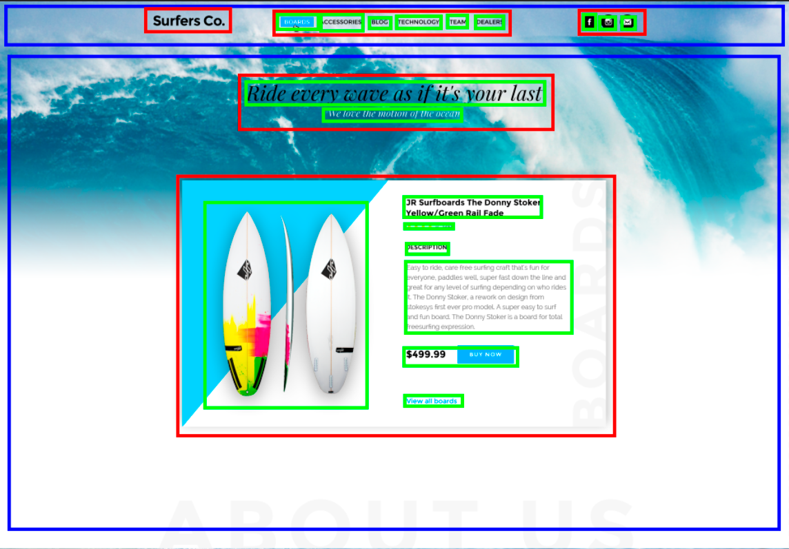

# 02. HTML

* [Полезные ссылки](./read.md)
* [Задание](./task.md)
* [Пример](./example)

## Работа с Photoshop (экспорт картинок)

После открытия документа в Photoshop вы увидите что-то похожее на это:


В левой части расположены инструменты. В правой – панель с настройками и информацией о файле. Из инструментов нам потребуется только "Перемещение" ("Move" в англоязычной версии), который сейчас выбран. В правой части – слои.

Хоткеи:
* Alt + mouse wheel: зумирование;
* Space + left mouse button: перемещение макета;
* Ctrl + left mouse button: выбор элемента или слоя (чекбокс "автовыбор" на верхней панели делает выбор элемента только по клику мыши, будьте внимательны);
* Ctrl + E: сведение слоев

Выберите какую-нибудь картинку на макете, чтобы она отобразилась в панели слоев (в панели слоев должна отобразиться именно картинка, а не папка или что-нибудь иное). Нажимаете правой кнопкой мыши на слой, выбираете пункт "Экспортировать как...", далее настройки экспорта и экспортируете файл.


> Также можете пользоваться опцией "Быстрый экспорт в PNG".

Есть такое понятие, как обтравочная маска (на панели слоев отображается стрелочкой). Для корректного экспорта вам необходимо свести все слои, к которым применена маска, а потом уже экспортировать.


В данном случае вам нужно свести слои "Surfing" и "Container", и только после этого экспортировать результат.

> Экспортируйте только те картинки, которые относятся к контенту сайта. С фоновыми картинками будем работать через CSS.

## Работа с макетом

> Начнем мы не с описания языка HTML. В начале будет рассказано о том, как работать с макетом, какие имена присваивать элементам, а только потом мы перейдем к HTML.

Весь ваш файл вы должны визуально или при помощи каких-либо инструментов (как вам удобнее) разделить на блоки:



Теперь напишем некоторый псевдокод, основываяся на данном макете:

<details>
   <summary>Code listing</summary>

```
header
    logo
    menu
        menu-item
        menu-item
        menu-item
        menu-item
        menu-item
        menu-item
    social-networks
        social-networks-item
        social-networks-item
        social-networks-item
section
    wrapper
        title
        subtitle
    product-card
        image
        title
        rating
        description-title
        description-content
        price
            price-content
            price-button
        button-view-all
```

</details>

## БЭМ

На этом моменте мы внедрим методологию БЭМ в наш небольшой проект. В соответствии с данной методологией мы и будем давать имена элементам.

> Надеюсь, что на этом моменте вы ознакомились с информацией в статьях по БЭМу, ссылки на которые были оставлены в файле [read.md](read.md). Если нет, то на данном моменте желательно с ними ознакомиться.

Итак, пишем нашу разметку:

<details>
   <summary>Code listing</summary>

```
header
    header__logo
    menu
        menu__item
        menu__item
        menu__item
        menu__item
        menu__item
        menu__item
    social-networks
        social-networks__item
        social-networks__item
        social-networks__item
main-section
    wrapper
        main-section__title
        main-section__subtitle
    product-card
        product-card__image
        product-card__title
        product-card__rating
        product-card__description-title
        product-card__description-content
        price
            price__content
            price__button
        product-card__button_view-all
```

</details>

На этом моменте мы заканчиваем работать с макетом и приступаем непосредственно к HTML.

## Основы HTML

Перед продолжением работы с проектом хотелось бы дать немного информации о самом HTML.

<details>
   <summary>Немного информации о самом HTML</summary>

В HTML есть два типа тегов: парные и одиночные. Пример:
<br>
парный тег `<div class="class-name"></div>`
<br>
одиночный тег `<input value="example">`

### Базовая разметка страницы:

```
<!DOCTYPE html>
<html lang="en">
   <head>
      <meta charset="utf-8" />
      <title>HTML Document</title>
   </head>
   <body>
   
   </body>
</html>
```

* `<!DOCTYPE html>` – тип документа (в данном случае HTML5);
* `<html>` – хранит в себе все содержимое веб-страницы;
* `<head>` – содержит информацию для браузеров и поисковых систем (не отображается на странице);
* `<meta>` – хранит информацию для браузера и поисковых систем (в данном случае тут указана кодировка документа);
* `<title>` – текст, отображающийся во вкладке браузера;
* `<body>` – контент, который отображается в браузере.

Вся разметка, которая отображается непосредственно в браузере, пишется между открывающим и закрывающим тегом `body`.

### Теги для заголовка страницы:

* `<h1></h1>` – `<h6></h6>`;
<br>
`h1` – самый главный заголовок. `h6` – наименее главный.
* `<p></p>` – обычный наборный текст (абзац, параграф);
* `<a href="url"></a>` – ссылка;
* `` – картинка;
* `<ul><li></li></ul>` – маркированный список (где li – это элемент маркированного списка);
* `<ol><li></li></ol>` – нумерованный список (где li – это элемент нумерованного списка);
* `<form></form>` – форма;
* `<input>` – поле ввода;
* `<div></div>` – универсальный тег.

### Атрибуты для тегов:

* `class` – используется для обращения к элементу (через CSS либо JS);
* `id` – так же используется для обращения к элементу, но идентификатор должен быть уникальным на странице.

Данные атрибуты универсальные и могут использоваться вместе с любым тегом. Преимущественно определенные атрибуты используются с определенными тегами. Какие атрибуты можно использовать для того или иного тега вы пожете посмотреть в [справочнике](https://webref.ru/html).

Все теги и атрибуты вам знать не обязательно и не пытайтесь их запомнить. Необходимо лишь знать основные из них и уметь пользоваться справочником (не обязательно тем, что приведен выше).
 
</details>

Итак, добавим к нашему проекту HTML:

<details>
   <summary>Code listing</summary>

```
<!DOCTYPE html>
<html lang="en">
    <head>
        <meta charset="utf-8" />
        <title>HTML Document</title>
    </head>
    <body>

        <div class="header">
            <div class="header__logo">
                <a href="#">
                    
                </a>
            </div>

            <ul class="menu">
                <li class="menu__item">
                    <a href="#"></a>
                </li>
                <li class="menu__item">
                    <a href="#"></a>
                </li>
                <li class="menu__item">
                    <a href="#"></a>
                </li>
                <li class="menu__item">
                    <a href="#"></a>
                </li>
                <li class="menu__item">
                    <a href="#"></a>
                </li>
                <li class="menu__item">
                    <a href="#"></a>
                </li>
            </ul>

            <ul class="social-networks">
                <li class="social-networks__item">
                    <a href="#">
                        
                    </a>
                </li>
                <li class="social-networks__item">
                    <a href="#">
                        
                    </a>
                </li>
                <li class="social-networks__item">
                    <a href="#">
                        
                    </a>
                </li>
            </ul>
        </div>
        
        <div class="main-section">
            <div class="wrapper">
                <h1 class="main-section__title"></h1>
                <h2 class="main-section__subtitle"></h2>
            </div>
            <div class="product-card">
                
                <h4 class="product-card__title"></h4>
                <div class="product-card__rating"></div>
                <h6 class="product-card__description-title"></h6>
                <p class="product-card__description-content"></p>
                <div class="price">
                    <p class="price__content"></p>
                    <button class="price__button"></button>
                </div>
                <a href="#" class="product-card__button_view-all"></a>
            </div>
        </div>
        
    </body>
</html>
```

</details>

> Для написания кода рекомендую использовать плагин emmet. Он позволяет писать небольшие конструкции вместо всей разметки.

> Меню верстается с использованием списка потому что [тык](https://ru.stackoverflow.com/questions/664515/%D0%9A%D0%B0%D0%BA%D0%BE%D0%B2%D0%B0-%D0%BF%D1%80%D0%B8%D1%87%D0%B8%D0%BD%D0%B0-%D0%BF%D0%BE-%D0%BA%D0%BE%D1%82%D0%BE%D1%80%D0%BE%D0%B9-%D0%BC%D0%B5%D0%BD%D1%8E-%D0%B2%D0%B5%D1%80%D1%81%D1%82%D0%B0%D1%8E%D1%82-%D1%87%D0%B5%D1%80%D0%B5%D0%B7-%D0%BD%D0%B5%D0%BD%D1%83%D0%BC%D0%B5%D1%80%D0%BE%D0%B2%D0%B0%D0%BD%D0%BD%D1%8B%D0%B9-%D1%81%D0%BF%D0%B8%D1%81%D0%BE%D0%BA-ul) и [тык](https://ru.stackoverflow.com/questions/818761/%D0%A1%D0%BC%D1%8B%D1%81%D0%BB-%D0%B2%D0%B5%D1%80%D1%81%D1%82%D0%BA%D0%B8-%D1%87%D0%B5%D1%80%D0%B5%D0%B7-%D1%81%D0%BF%D0%B8%D1%81%D0%BA%D0%B8-ul-li-html-css). Также используйте списки и для других однотипных элементов, которые можно объединить по смыслу (например кнопки социальных сетей).

## Семантическая верстка

Семантическая верстка – это верстка с использованием элементов (тегов) в соответствии с их предназначением. То есть, если вы будете верстать, используя везде универсальный тег `div`, то по сути говоря ничего плохого не случится. Вы сможете открыть HTML файл в браузере и увидеть содержимое. Вы сможете стилизовать его при помощи CSS, продолжать и дальше работать с такой версткой, но это плохо по нескольким причинам:

1. Сложности в поддержке вашего кода;
2. Сложности просмотра файла роботами.

<details>
   <summary>Несколько слов про роботов</summary>

В данном пункте под словом "роботы" имелись ввиду программы, алгоритмы и прочее, которые будут читать ваш сайт и работать с ним. Что именно это? Это может быть поисковой робот, который будет "читать" ваш сайт и в зависимости от качества верстки поднимать или опускать в поисковой выдаче. Это может быть озвучивание элементов голосовым помощником либо увеличение размера шрифта для людей с ослабленным зрением (которое также выполняется не вами, а определенным алгоритмом). Это может быть обычный режим чтения в браузере.

Суть всего этого в том, что человек, взглянув на макет, может определить где на сайте меню, где обычная ссылка, где контент, а где контактная информация. Роботы же этого определить не могут. Поэтому необходимо верстать сайт с использованием тегов, подходящих для элементов, которые будут находиться внутри них. Только после этого роботы смогут более точно определять, что именно за элементы находятся на вашем сайте.

</details>

> На этом моменте желательно ознакомиться со статьями по семантической верстке из файла [read.md](read.md).

Возьмем наш код, который мы писали ранее, и изменим его в соответствии с семантикой:

<details>
   <summary>Code listing</summary>

```
<!DOCTYPE html>
<html lang="en">
    <head>
        <meta charset="utf-8" />
        <title>HTML Document</title>
    </head>
    <body>

        <header class="header">
            <div class="header__logo">
                <a href="#">
                    
                </a>
            </div>

            <nav class="menu">
                <ul>
                    <li class="menu__item">
                        <a href="#"></a>
                    </li>
                    <li class="menu__item">
                        <a href="#"></a>
                    </li>
                    <li class="menu__item">
                        <a href="#"></a>
                    </li>
                    <li class="menu__item">
                        <a href="#"></a>
                    </li>
                    <li class="menu__item">
                        <a href="#"></a>
                    </li>
                    <li class="menu__item">
                        <a href="#"></a>
                    </li>
                </ul>
            </nav>

            <ul class="social-networks">
                <li class="social-networks__item">
                    <a href="#">
                        
                    </a>
                </li>
                <li class="social-networks__item">
                    <a href="#">
                        
                    </a>
                </li>
                <li class="social-networks__item">
                    <a href="#">
                        
                    </a>
                </li>
            </ul>
        </header>
        
        <main>
            <article class="main-section">
                <div class="wrapper">
                    <h1 class="main-section__title"></h1>
                    <h2 class="main-section__subtitle"></h2>
                </div>
                <div class="product-card">
                    
                    <h4 class="product-card__title"></h4>
                    <div class="product-card__rating"></div>
                    <h6 class="product-card__description-title"></h6>
                    <p class="product-card__description-content"></p>
                    <div class="price">
                        <p class="price__content"></p>
                        <button class="price__button"></button>
                    </div>
                    <a href="#" class="product-card__button_view-all"></a>
                </div>
            </article>
        </main>
        
    </body>
</html>
```

</details>

## Валидация верстки

Валидация защищиает вас от неправильного и нецелесообразного использования тегов, атрибутов и т.д.. С практической точки зрения она полезна для SEO. В качестве валидатора можете использовать [validator.w3.org](https://validator.w3.org/).

Итак, загружаем нашу верстку в валидатор:


Как вы видите в верстке есть некоторые предупреждения из-за пустых тегов (у вас, конечно же, такого быть не должно).

[Назад](./../README.md)
