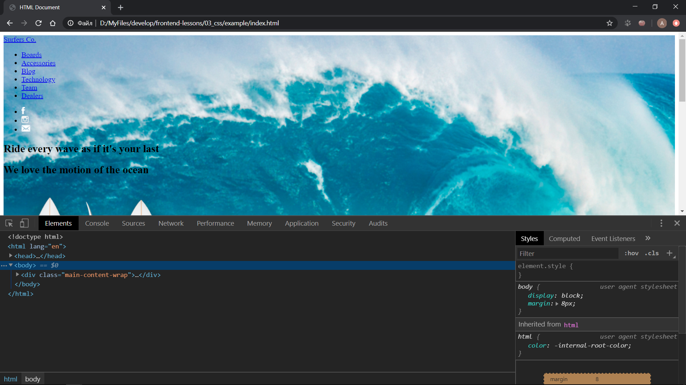
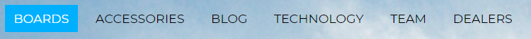
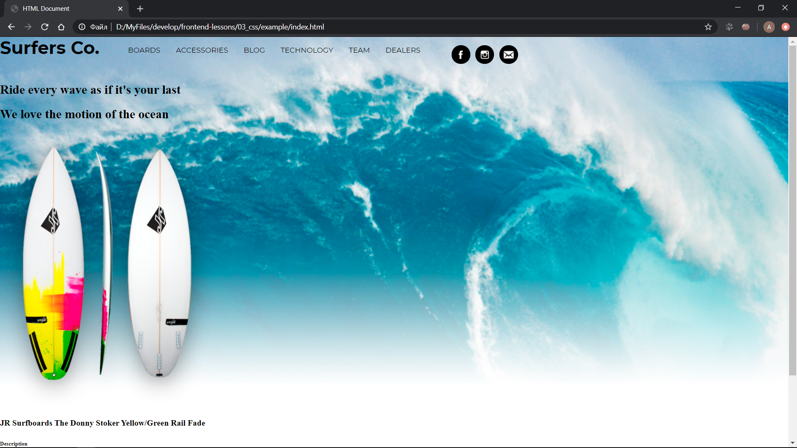
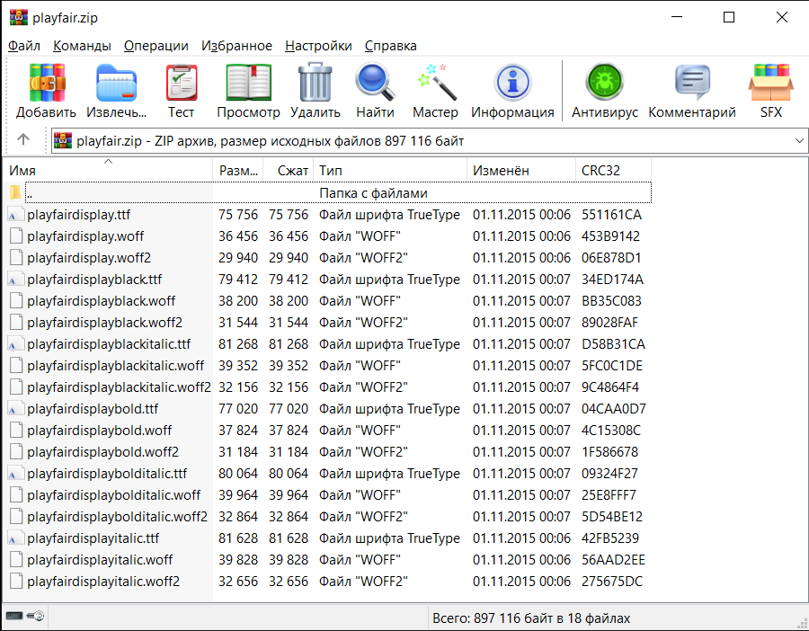
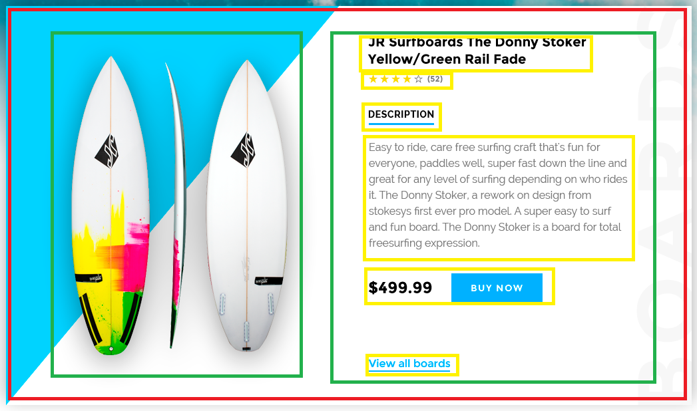
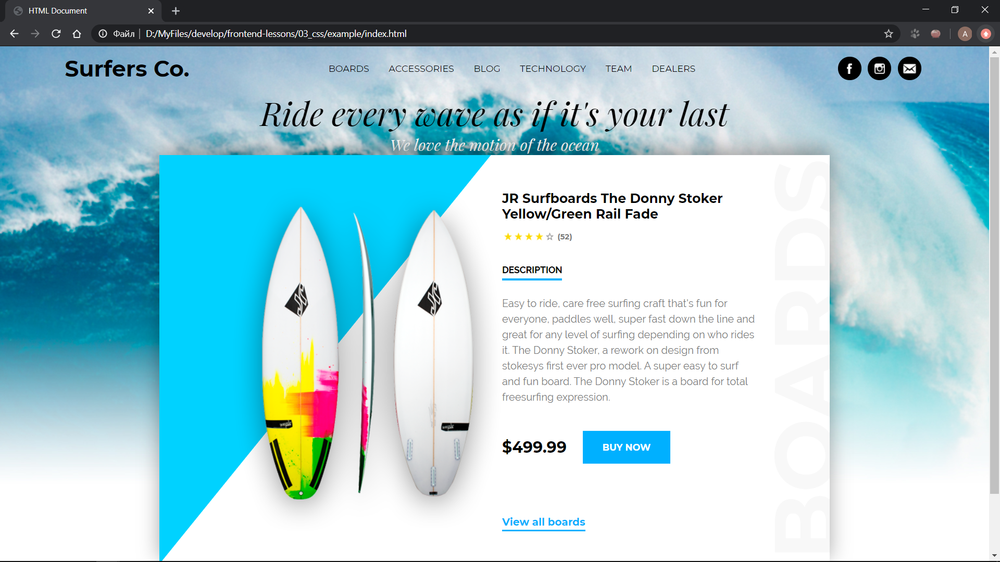
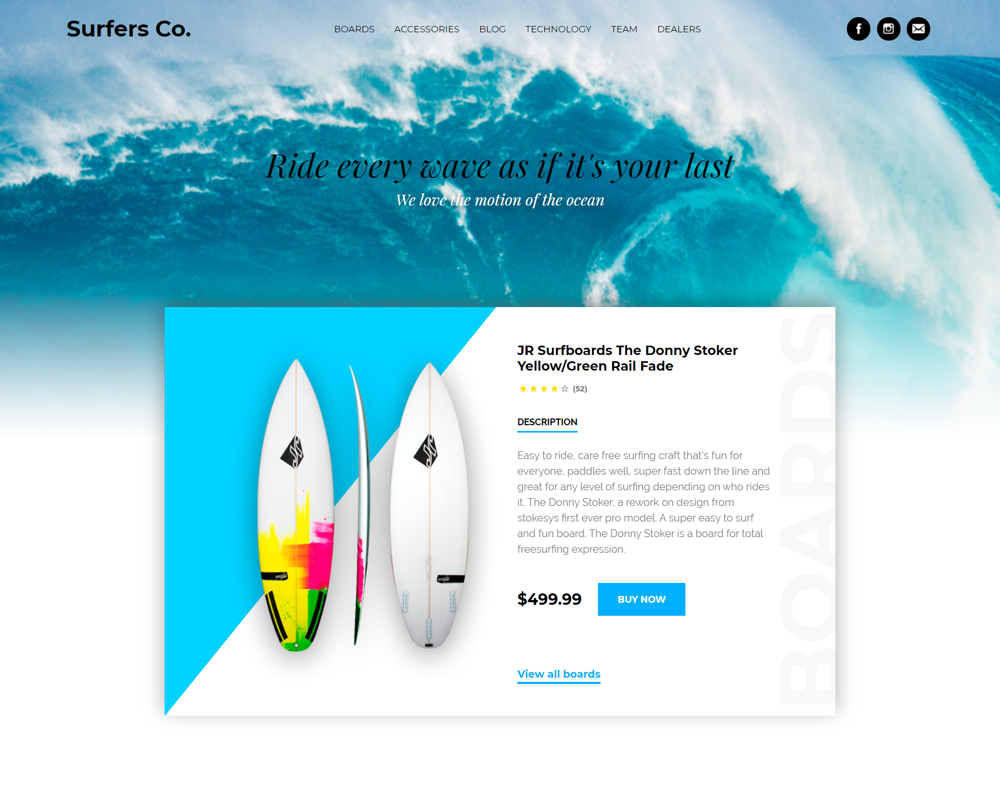

# Практика (CSS)

> Небольшая заметка 1. Все css свойства, которые будут даваться ниже, рекомендуется дополнительно просматривать в справочнике, чтобы знать, какие еще значения они могут принимать.

> Небольшая замека 2. В css вы так же можете использовать плагин emmet.

Первым делом создаем папку `css` внутри папки `assets`, создаем файл header.css для меню (название можете придумать любое адекватное, но желательно на латинице и без пробелов) и подключаем его в `.html` файл. Еще создадим файл main-section.css для главного блока.

> Если хотите, то можете разбить ваш css файл на несколько маленьких и писать стили для каждого блока отдельно (например menu.css, main-section.css и т. д.). Потом подключать все эти файлы в `.html`. В следующих занятиях мы будем собирать все наши файлы в один.

Так как наше меню и наш блок имеют одну фоновую картинку, то нам лучше их обернуть.

> Ситуации, когда приходится менять html разметку при написании стилей – это нормально. Они неизбежны.

Итак, наша разметка:

```
<div class="main-content-wrap">
    <header class="header">
        ...
    </header>
    <main>
        ...
    </main>
</div>
```

Теперь пишем стили в файле main-section.css:

```
.main-content-wrap {
    background-image: url(./../assets/img/wave-bg.jpg);
    /* по умолчанию картинка дублируется и если вы этого не хотите – прописывайте это свойство */
    background-repeat: no-repeat;
}
```

> Будьте внимательны со свойством `background`, так как если у блока будет нулевая ширина или высота, то изображение просто не отобразится.

> Посмотрите на [этой странице](https://webref.ru/css/background) что вы еще можете задавать при помощи свойства `background`.

Итак, вот что у нас получилось:



Я выделил тег `body`, чтобы вы увидели его свойства. В левой панели вы можете наблюдать внешний отступ (margin). Создадим новый файл `reset.css` и обнулим этот стиль (если вы скачивали reset либо normalize, то этот шаг для вас не обязателен):

```
body {
    margin: 0;
}
```

## Верстка меню

Начнем с логотипа. Смотрим шрифт, размер и его цвет. У меня шрифт `Montserrat` и я могу воспользоваться [fonts.google.com](https://fonts.google.com/) для его подключения. Ввожу название шрифта, добавляю его, кастомизирую (выбираю насыщенность) и добавляю строку с его подключением в тег `head` моего HTML файла (потом вы можете добавить или удалить ненужные значения насыщенности):

```
<link href="https://fonts.googleapis.com/css?family=Montserrat:400,500,700&display=swap" rel="stylesheet">
```

> Если шрифта, который у вас в макете, на `google.fonts` не оказалось, то это значит, что вам не повезло. Вам нужно будет найти шрифт, скачать его и подключить через `@font-face`. Ссылки с описанием подключения будут в файле [read.md](./../read.md).

Теперь пишем стили для нашего логотипа в файле header.css:

```
.header__logo a {
    /* название шрифта */
    font-family: 'Montserrat', sans-serif;
    /* насыщенность шрифта */
    font-weight: bold;
    /* размер шрифта */
    font-size: 34px;
    /* цвет текста */
    color: #000;
    /* удаление подчеркивания */
    text-decoration: none;
}
```

> Css свойство `color` всегда устанавливает цвет текста. Если хотите установить цвет фона, то вам необходимо исользовать `background-color`.

`text-decoration` и `color` мы удалим отсюда, переместим в файл reset.css и применим к тегу `a`.

<hr>

> Далее пойдет flexbox и желательно ознакомиться с информацией из статей, ссылки на которые находятся в файле [read.md](./../read.md).

Теперь выравниваем наш заголовок в одну строку при помощи flexbox (а также выравниваем пункты меню и социальные сети):

```
.header,
.header .menu ul,
.header .social-networks {
    display: flex;
}
```

Чтобы убрать маркеры у маркированного списка нам нужно прописать в reset.css следующее свойство:

```
li {
    /* убрать маркеры у списка */
    list-style-type: none;
}
```

Сейчас будем работать над самими пунктами меню. Для начала мы укажем классы в HTML файле для наших ссылок:

```
<li class="menu__item">
    <a class="menu__link" href="#boards">Boards</a>
</li>
```

Потом пропишем свойства для ссылок:

```
.header .menu .menu__link {
    font-family: 'Montserrat', sans-serif;
    font-size: 14px;
    /* текст в верхнем регистре */
    text-transform: uppercase;
    /* внутренний отступ (первое число – отступ с верхнего края и нижнего, второе – с правого и левого) */
    padding: 7px 10px;
    /* внешний отступ (со значениями логика такая же) */
    margin: 0 5px;
    /* анимация свойств которые будут меняться */
    transition: 300ms;
}

.header .menu .menu__link:hover {
    color: #fff;
    background-color: #00b0ff;
}
```

Тут мы добавили псевдокласс `:hover`. Ознакомьтесь, пожалуйста, в справочнике с тем, какие еще псевдоклассы и псевдоэлементы есть. Также добавили новое для нас свойство `transition`. Оно будет анимировать свойства `color` и `background-color` (с тем, какие именно свойства можно анимировать, вы можете познакомиться в справочнике на странице определенного свойства).

Обратите внимание на внешний и внутренний отступ. Их отличие в том, что при помощи внутреннего отступа мы _играем_ с _воздухом_ внутри элемента (чтобы при наведении и появлении фона элемент не выглядел слишком сжатым), а при помощи внешних отступов мы регулируем расстояние между элементами. То есть в большинстве случаев внутренний отступ используется для настройки вида самого элемента, а внешний – для настройки его внешнего пространства (отступы снаружи и прочее).

Вот, что у нас получилось с меню:



<hr>

Итак, двигаемся дальше и приступаем к кнопкам социальных сетей. Так как мы имеем картинки разных размеров, мы не можем в данном случае пользоваться паддингами (из-за того, что круги могут получиться тоже разных размеров). Мы просто сделаем круглую обертку фиксированной ширины и высоты и выровняем картинку внутри нее при помощи флексов.

Немного видоизменим нашу разметку:

```
<a class="social-networks__link" href="#">
    
</a>
```

Теперь пишем стили:

```
.header .social-networks .social-networks__link {
    width: 36px;
    height: 36px;
    background-color: #000;
    /* задаем данное отображение чтобы мы могли выравнивать содержимое контейнера при помощи флексбоксов */
    display: flex;
    /* выравниваем по горизонтали по центру */
    justify-content: center;
    /* выравниваем по вертикали по центру */
    align-items: center;
    margin: 0 5px;
    /* задаем скругление углов */
    border-radius: 50px;
}
```

Обратите внимание на свойство `display: flex;`. После задания данного свойства мы можем выравнивать контент по вертикали и горизонтали. Без `display: flex` данный способ выравнивания работать не будет. Также обратите внимание на новое свойство `border-radius`.

Вот что у нас пока что получилось:



<hr>

Теперь будем работать с выравниванием меню по центру. Когда мы выравнивали все элементы в строку, то мы уже задали для меню свойство `flex`. Теперь нам остается выровнять все элементы по центру по вертикали и горизонтали.

```
.header {
    align-items: center;
    justify-content: space-around;
}
```

Свойство `justify-content: space-around` разбрасывает элементы по краям блока оставляя между ними одинаковые расстояния. Если бы мы использовали `justify-content: center`, то элементы просто стали бы по центру вплотную друг у другу.

Также было замечено, что у тега `ul` были ненужные внутренние отступы. Обнуляем их в файле reset.css:

```
ul {
    padding: 0;
}
```

Поздравляю. Меню сверстано. Переходим к следующему блоку.

## Верстка главного блока

Итак, для начала разберемся со шрифтами. Ищем следующий шрифт. Мне повезло и я нахожу его на `fonts.google`. Но допустим, что мне не повезло и необходимо скачать его и подключить. Для этого я скачиваю его и получаю архив со всеми начертаниями.



Судя по макету мне понадобится только regular italic. Берем все расширения и копируем в наш проект, создав отдельную папку.

> Несколько расширений необходимы, потому что каждый браузер пользуется своим расширением. Об этом вы можете почитать [тут](http://xiper.net/collect/html-and-css-tricks/typographics/font-face-in-the-details).

В правиле `@font-face` указываем название шрифта (чтобы мы потом могли к нему обращаться) и ссылки на шрифт с форматом:

```
@font-face {
    font-family: 'Playfair Display';
    src: url('./../assets/fonts/playfairdisplayitalic.woff2') format('woff2'), url('./../assets/fonts/playfairdisplayitalic.woff') format('woff'), url('./../assets/fonts/playfairdisplayitalic.ttf') format('truetype');
}
```

Так как у нас только одно начертание и насыщенность шрифта, то тех свойств, которые мы прописали выше, будет достаточно. Однако если вы подключаете шрифты с несколькими начертаниями, то необходимо будет в `@font-face` все это указать.

Теперь применяем шрифты к заголовку и подзаголовку в файле main-section.css:

```
.main-section .main-section__title,
.main-section .main-section__subtitle {
    font-family: 'Playfair Display';
    font-weight: 400;
    font-style: italic;
    /* выравнивание текста по центру */
    text-align: center;
}

.main-section .main-section__title {
    font-size: 50px;
}

.main-section .main-section__subtitle {
    font-size: 24px;
    color: #ffffff;
    /* тень текста */
    text-shadow: 0px 3px 15px rgba(0, 0, 0, 0.64);
}
```

> Разбивать css стили на несколько файлов для каждого блока – немного спорное решение. Однако учитывая то, что мы с вами будем потом использовать препроцессор для написание стилей – это нам точно не повредит.

Из новых свойств тут мы имеем тень для текста. Ее можно получить несколькими способами:
* Перейти в свойства слоя и попытаться воспроизвести тень получив все ее значения;
* Кликнуть правой кнопкой мыши, выбрать пункт `Копировать CSS`, вставить в редактор кода и выбрать свойство для тени.

Здесь был использован второй способ.

> Пожалуйста, не стоит копировать css стили из фотошопа и бездумно вставлять их все себе в проект. Пользуйтесь только некоторыми свойствами, которые сложно воспроизвести (как например тень). Фотошоп имеет много не очень хороших стилей, таких как вырывание элемента из потока, которые крайне не рекомендуется использовать без особой нужды.

У наших заголовков есть лишний отступ. Обнуляем их в файле `reset.css` (заодно обнулим отступы у всех остальных заголовков и для параграфа):

```
h1,
h2,
h3,
h4,
h5,
h6,
p {
    margin: 0;
}
```

Итак, с заголовками мы закончили и идем дальше.

<hr>

Верстаем карточку. Перед этим внесем некоторые корректировки в HTML:

```
<div class="product-card">
    
    <div class="product-card__description">
        <h4 class="product-card__title">
            JR Surfboards The Donny Stoker Yellow/Green Rail Fade
        </h4>
        <div class="product-card__rating"></div>
        <h6 class="product-card__description-title">Description</h6>
        ...
    </div>
</div>
```

Теперь наше содержимое выглядит следующим образом:



Для чего мы изменяли нашу разметку? В данном случае мы будем верстать при помощи флексов. Мы будем применять свойство `display: flex` к нашему красному контейнеру чтобы его содержимое стало в одну строку. В итоге мы получим два зеленых блока, которые будут стоять рядом друг с другом. В противном случае, если бы мы не изменяли нашу разметку, у нас в линию выстроился бы весь наш контент (картинка, описание, цена, кнопка и т. д.).

```
.main-section .product-card {
    display: flex;
    align-items: center;
    background-color: #fff;
    width: 1030px;
    /* выравнивание блока по центру по горизонтали */
    margin: 0 auto;
}
```

<hr>

Применяем стили к заголовку нашей карточки:

```
.main-section .product-card .product-card__title {
    font-family: 'Montserrat', sans-serif;
    font-weight: bold;
    font-size: 20px;
    /* ширина задается для переноса текста на следующую строку */
    width: 340px;
}
```

<hr>

Теперь верстаем рейтинг (звездочки). Как вы видите, некоторые звездочки активны, а некоторые – нет. Такие элементы желательно верстать таким образом, чтобы при добавлении тегу какого-либо класса (обычно используется класс `.active`) элемент становился активным. Это можно реализовать через CSS (то есть мы не должны использовать внутри HTML тег для картинки).

Итак, начинаем. Начнем с HTML файла:

```
<div class="product-card__rating rating">
    <ul class="rating__stars-wrap">
        <li class="rating__star"></li>
        <li class="rating__star"></li>
        <li class="rating__star"></li>
        <li class="rating__star"></li>
        <li class="rating__star"></li>
    </ul>
    <p class="rating__number">(52)</p>
</div>
```

Теперь перейдем к нашему main-section.css файлу:

```
.main-section .product-card .rating .rating__star {
    background-image: url(./../assets/img/star-inactive.png);
    background-size: contain;
    background-position: center;
    background-repeat: no-repeat;
    width: 13px;
    height: 13px;
    margin-left: 3px;
}

.main-section .product-card .rating .rating__star.active {
    background-image: url(./../assets/img/star-active.png);
}
```

Свойство `background-size` задает размер картинки в зависимости от родительского блока (будет лучше, если вы почитаете об этом свойстве [тут](https://webref.ru/css/background-size)). `background-position` центрирует нашу фоновую картинку. `background-repeat` запрещает ей повторяться (по умолчанию картинка повторяется).

Итак, теперь мы можем добавить элементу `.rating__star` класс `.active` и звезда станет активной. Сделаем это в разметке.

Теперь пропишем стили для нашего числа в скобках:

```
.main-section .product-card .rating .rating__number {
    font-family: 'Montserrat', sans-serif;
    font-weight: bold;
    font-size: 12px;
    color: #787878;
}
```

И выровняем все используя флексы:

```
.main-section .product-card .rating {
    display: flex;
    align-items: center;
    margin-bottom: 20px;
}

.main-section .product-card .rating .rating__stars-wrap {
    display: flex;
    margin-right: 5px;
}
```

<hr>

Теперь верстаем текст описания товара. Он имеет другой шрифт `Raleway`. Мучаться не будем и подключим его через `fonts.google`.

Начнем с заголовка. Прописываем стили для него:

```
.main-section .product-card .product-card__description-title {
    font-family: 'Raleway', sans-serif;
    font-weight: bold;
    font-size: 14px;
    /* свойство, которое делает все буквы заглавными */
    text-transform: uppercase;
    position: relative;
    display: inline;
    margin-top: 30px;
    margin-bottom: 40px;
}

.main-section .product-card .product-card__description-title:after {
    content: '';
    width: 100%;
    height: 3px;
    position: absolute;
    left: 0;
    bottom: -8px;
    background-color: #00b0ff;
}
```

При помощи псевдоэлемента `after` нарисована черта под заголовком. Обычно псевдоэлементы `after` и `before` используются для небольших элементов, которые не несут никакой смысловой нагрузки. Данные псевдоэлементы обязательно должны иметь свойство `content` (которое может быть пустое). Линия позиционирована при помощи `position: absolute` (про позиционирование можете прочесть [тут](http://dreamhelg.ru/2011/02/css-position-in-10-steps/)). И обратите, пожалуйста, внимание на свойство `display: inline`. Оно задается, потому что заголовки по умолчанию являются блочными элементами и занимают ширину в 100% (в данном случае линия будет так же растягиваться на ширину в 100%). Чтобы линия не растягивалась вместе с заголовком мы делаем наш элемент строчным.

Теперь верстаем основной текст:

```
.main-section .product-card .product-card__description-content {
    font-family: 'Raleway', sans-serif;
    font-weight: 400;
    font-size: 16px;
    color: #787878;
    /* высота строки */
    line-height: 24px;
    width: 390px;
}
```

<hr>

Верстаем цену и кнопку:

```
.main-section .product-card .price {
    display: flex;
    align-items: center;
    margin-bottom: 80px;
}

.main-section .product-card .price__content {
    font-family: 'Montserrat', sans-serif;
    font-weight: bold;
    font-size: 24px;
    margin-right: 25px;
}

.main-section .product-card .price__button {
    font-family: 'Montserrat', sans-serif;
    font-weight: bold;
    font-size: 14px;
    text-transform: uppercase;
    color: #fff;
    background-color: #00b0ff;
    padding: 17px 30px;
    /* меняет внешний вид курсора при наведении на кнопку */
    cursor: pointer;
}
```

У кнопки есть обводка. Уберем ее в файле `reset.css`:

```
button {
    border: 0;
}
```

<hr>

Теперь верстаем ссылку:

```
.main-section .product-card .product-card__button_view-all {
    font-family: 'Montserrat', sans-serif;
    font-size: 16px;
    font-weight: bold;
    color: #00b0ff;
    position: relative;
}

.main-section .product-card .product-card__button_view-all:after {
    content: '';
    width: 100%;
    height: 3px;
    position: absolute;
    left: 0;
    bottom: -5px;
    background-color: #00b0ff;
}
```

<hr>

Теперь добавим стили для самой карточки товара:

```
.main-section .product-card {
    padding: 50px 0;
    box-sizing: border-box;
    justify-content: center;
    position: relative;
    /* скрывает элементы выходящие за пределы данного блока */
    overflow: hidden;
    /* управляет элементом по оси z (чем больше значение относительно других элементов, тем данный элемент будет выше) */
    z-index: 2;
    /* тень для блока */
    box-shadow: 0px -8px 30px 0px rgba(0, 0, 0, 0.34);
}

/* треугольник */
.main-section .product-card:before {
    content: '';
    position: absolute;
    top: -374px;
    left: -165px;
    /* поворот блока (значение указывается в градусах) */
    transform: rotate(39deg);
    width: 0;
    height: 0;
    /* границы блока для каждой стороны */
    border-top: 500px solid transparent;
    border-right: 500px solid #00d2ff;
    border-bottom: 500px solid transparent;
    z-index: -2;
}

/* слово Boards */
.main-section .product-card:after {
    content: 'Boards';
    text-transform: uppercase;
    transform: rotate(-90deg);
    position: absolute;
    right: -270px;
    font-family: 'Montserrat', sans-serif;
    font-size: 135px;
    font-weight: bold;
    /* прозрачность */
    opacity: 0.03;
}
```

Треугольник и слово boards реализованы при помощи псевдоэлементов `after` и `before`. Пример реализации треугольника можно найти в интернете.

<hr>

Пока что мы имеем такой результат:



Нам необходимо немного подправить отступы и верстка будет готова.

Подправим отступы в заголовке, подзаголовке блока, у картинки и в меню (файл `header.css`):

```
.main-section {
    padding: 130px 0;
}
.main-section .product-card .product-card__image {
    margin-right: 30px;
}
.main-section .main-section__title {
    margin-bottom: 5px;
}
.main-section .main-section__subtitle {
    margin-bottom: 150px;
}
.header {
    padding: 10px 0;
}
```

Вот что у нас в итоге получилось:



[Назад](./../)
