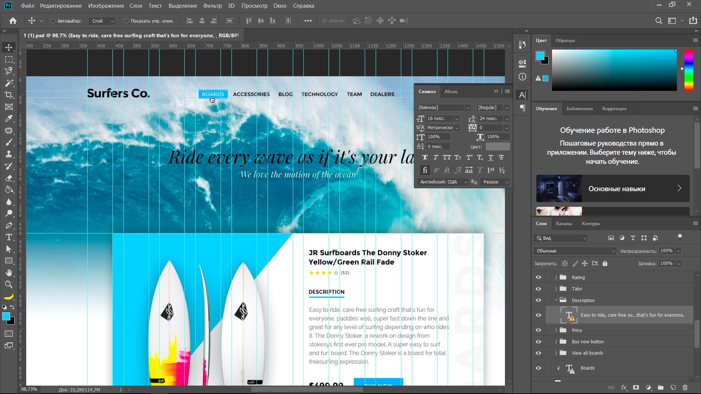
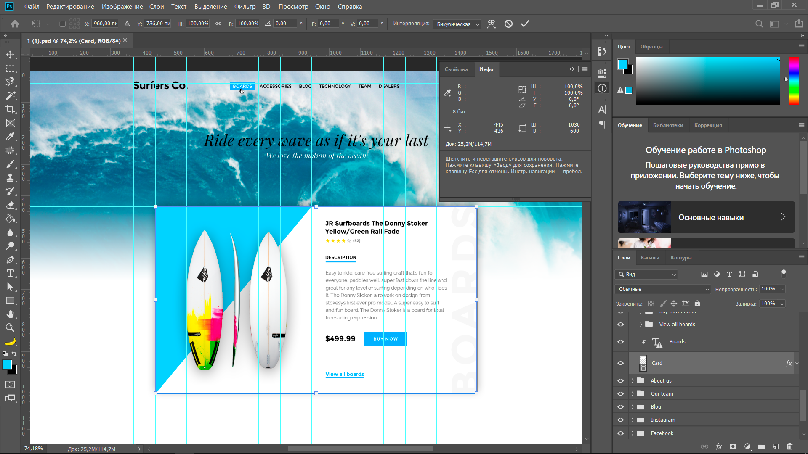
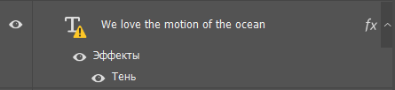
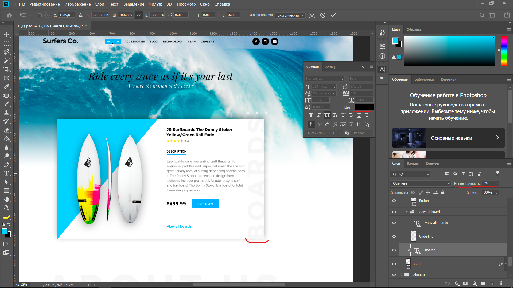

# Работа в Photoshop (CSS)

Итак, запускаем photoshop и открываем наш файл. Для просмотра стилей нам потребуются некоторые дополнительные окна:

* Свойства;
* Инфо;
* Символ.

Все эти окна/пункты можно найти в выпадающем списке после клика на **Окно** в верхней части экрана.

Информацию о тексте вы можете увидеть в окне **Символ** (само собой перед тем, как увидеть информацию о тексте, вам нужно сначала выделить слой).

Тут вы увидите всю необходимую нам информацию (семейство шрифта, насыщенность, размер, цвет и прочее).

Информацию о цвете вы можете получить кликнув пипеткой в интересующую вас область (чтобы выбрать пипетку найдите ее на левой панели либо нажмите хоткей `I`). После получения цвета нажмите на квадрат с полученным цветом два раза в левой нижней части экрана и вы увидите его значение.

Информацию о размерах элемента вы можете получить кликнув на сам элемент и после перехода в режим редактирования (ctrl + t) вы можете увидеть в окне **Инфо**. Для выхода из режима редактирования нажмите на клавишу esc.

Некоторые слои в фотошопе имеют некоторые дополнительные свойства (тень, затемнение, наложение градиента и прочие). Обозначаются такоие слои стрелочкой с правого края (при нажатии на которую вы можете раскрыть или скрыть свойства) и буквами `fn`:

При двойном клике вы можете увидеть все свойства, которые применены к слою.

У слоев есть такое свойство, как непрозрачность. Вы можете видеть какой-нибудь элемент (допустим текст), у которого есть определенный цвет, но визуально цвет у элемента другой насыщености. В таком случае вам следует проверить параметр непрозрачность.

[Назад](./../)
