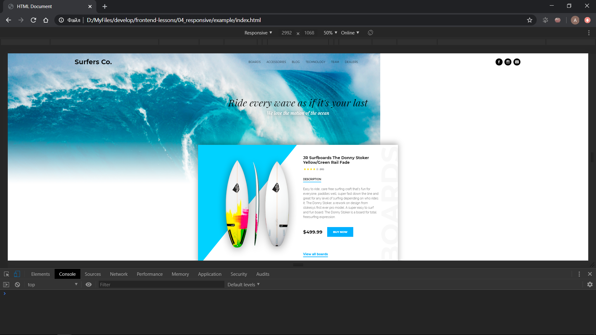
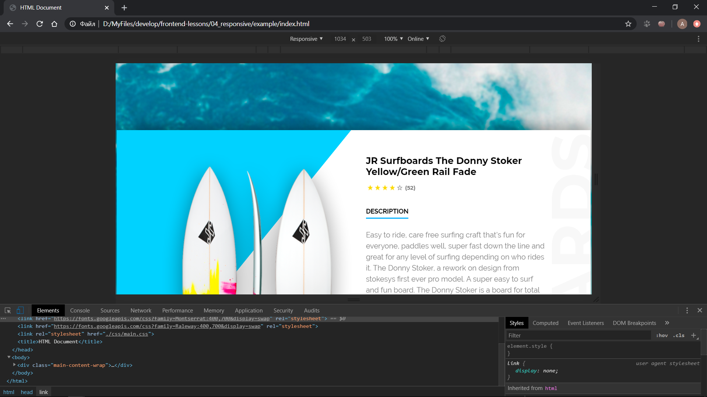
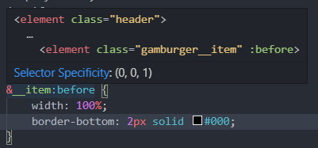

# 04. Препроцессоры и адаптив

* [Полезные ссылки](./read.md)
* [Задание](./task.md)
* [Пример](./example)

## Препроцессоры

Препроцессоры служат для расширения синтаксиса обычного css и внедрения дополнительных возможностей. В данном руководстве мы будем работать с препроцессором SCSS.

## Начало работы

Если вы пользуетесь `Visual Studio Code`, то вы можете установить расширение `Live Sass Compiler` для компилирования файлов препроцессора в обычный css. Если же у вас такой возможности нет, то можете посмотреть другие варианты на [этой](https://sass-scss.ru/install/) странице.

## Адаптив

Адаптивная верстка достигается путем использования медиа запросов. В медиа запросах вам необходимо переопределять стили для некоторых элементов. Например, сделать размер шрифта меньше, уменьшить паддинги и маржины для элементов, если необходимо, то сделать ширину меньше или больше и т.д.

## Практика

> Перед практикой переименуйте вашу папку css в scss. Также поменяйте расширения файлов с css на scss и добавьте перед именем файла нижнее подчеркивание (например `header.css` -> `_header.scss`).

Создайте главный файл (например main.scss) и импортируйте все свои файлы в него. У меня получилось так:

```
@import 'reset';
@import 'fonts';
@import 'header';
@import 'main-section';
```

> Да, вы можете импортировать файлы без указания нижнего подчеркивания и расширения.

> Нижнее  подчеркивание необходимо, чтобы скрывать файлы от компилятора. С таким подходом есть некоторые плюсы. Например, у нас будет один обычный файл (к примеру main.scss), а остальные файлы будут скрыты. У нас не создадится после компиляции `reset.css`, `fonts.css` и так далее. Все содержимое данных файлов будет храниться внутри `main.css` и на выходе у нас будет один файл со всем содержимым.

Также не забудьте изменить подключение css в html файле.

Есть два варианта написания медиа запросов: в отдельном файле или в том же самом. Моя реализация будет выполнена в отдельном файле.

Для начала растянем наш сайт по ширине и посмотрим как он отображается.



Как вы видите, мы имеем некоторые проблемы с фоновой картинкой. Фиксится это в файле `_main-cintent.scss` таким образом (для данной правки медиа запросы не нужны):

```
.main-content-wrap {
    ...
    background-size: cover;
    background-position: center;
}
```

Теперь уменьшаем нашу ширину экрана и видим, что на ~1050 пикселях наша верстка начинает ломаться.



Немного увеличим ширину экрана (1100 пикселей) и тут мы сделаем первую точку остановки. Мы уберем меню, заменив его гамбургер кнопкой, и уберем картинку:

```
@media (max-width: 1100px) {
    .header {
        padding: 10px 5%;
        justify-content: space-between;
        .hamburger {
            display: flex;
        }
        .menu,
        .social-networks {
            display: none;
        }
    }
}
```

Тут мы скрываем меню и кнопки социальных сетей и показываем наш гамбургер. Так как гамбургера у нас нет, то мы пока что ничего не увидим. Также мы немного изменили логику нашего меню, чтобы оно было немного растянуто по краям.

Теперь добавим гамбургер в нашу разметку:

```
<header class="header">
    ...
    <div class="hamburger">
        <div class="hamburger__item"></div>
    </div>
</header>
```

Напишем для него стили в файле header.scss:

```
.header {
    .hamburger {
        width: 30px;
        height: 15px;
        cursor: pointer;
        display: none;
        justify-content: center;
        align-items: center;
        position: relative;
        &__item,
        &__item:after,
        &__item:before {
            width: 100%;
            border-bottom: 2px solid #000;
        }
        &__item:after,
        &__item:before {
            content: '';
            position: absolute;
        }
        &__item:after {
            top: 0;
        }
        &__item:before {
            bottom: 0;
        }
    }
}
```

Обратите внимание, что хотя мы и выравниваем элементы внутри блока `.hamburger` при помощи флексбоксов, в свойстве `display` указано другое значение. На этом моменте содержимое не выравнивается (и вообще весь контейнер скрыт). Выравнивание содержимого и отображение контейнера срабатывает на ширине экрана не больше 1100 пикселей (что указано у нас в медиа запросе).

> Возможно для начала вам будет сложновато разобраться в синтаксисе и вложенностях языка scss. В редакторе VS Code вы можете при наведении на селектор увидеть элемент к которому будут применяться данные правила.
>
> 

Следующим шагом немного подправим заголовок, карточку товара и уберем картинку:

```
@media (max-width: 1100px) {
    .main-content-wrap {
        .header {
            ...
            .hamburger {
                ...
            }
            .menu,
            .social-networks {
                ...
            }
        }
        .main-section {
            &__title {
                line-height: 50px;
                margin-bottom: 20px;
            }
            &__title,
            &__subtitle {
                padding: 0 5%;
            }
            .product-card {
                padding: 40px;
                width: 95%;
                &__title,
                &__description-content {
                    width: auto;
                }
                &__image {
                    display: none;
                }
            }
        }
    }
}
```

Теперь напишем буквально несколько стилей для более маленького разрешения:

```
@media (max-width: 460px) {
    .main-content-wrap {
        .main-section {
            &__subtitle {
                margin-bottom: 120px;
            }
            .product-card {
                .price {
                    margin-bottom: 30px;
                    &__content {
                        font-size: 20px;
                        margin-right: 22px;
                    }
                    &__button {
                        padding: 14px 24px;
                        font-size: 12px;
                    }
                }
            }
        }
    }
}
```

> Когда же следует расставлять точки остановки? Просто начите с большого или маленького разрешения экрана и постепенно уменьшайте (или увеличивайте, если вы начали с маленького) до тех пор, пока не увидите, что необходимо выставить точку остановки. Однако старайтесь, чтобы их не было много. Больше 5 делать не стоит.

Также формат `.scss` поддерживает переменные, которые мы сейчас внедрим в наш проект.

> Да, обычный css поддерживает переменные тоже.

В папке scss создаем новый файл `_variables.scss` и создадим там пару переменных (не забудем импортировать наш файл):

```
// main colors

$light-color: #ffffff;
$dark-color: #000000;
$active-color: #00b0ff;


// text colors

$text-dark-color: #000000;
$text-light-color: #ffffff;
$text-gray-color: #787878;
$text-active-color: $active-color;
```

Теперь будем внедрять их в свою разметку:

```
_header.scss

.header .menu .menu__link:hover {
    color: $text-light-color;
    background-color: $active-color;
}
.header .social-networks .social-networks__link {
    background-color: $dark-color;
}
.header {
    .hamburger {
        &__item,
        &__item:after,
        &__item:before {
            width: 100%;
            border-bottom: 2px solid $dark-color;
        }
    }
}
...
```

[Назад](./../README.md)
