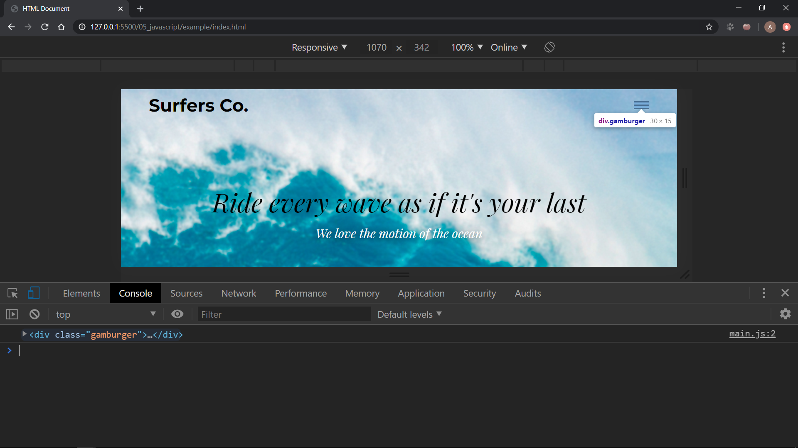
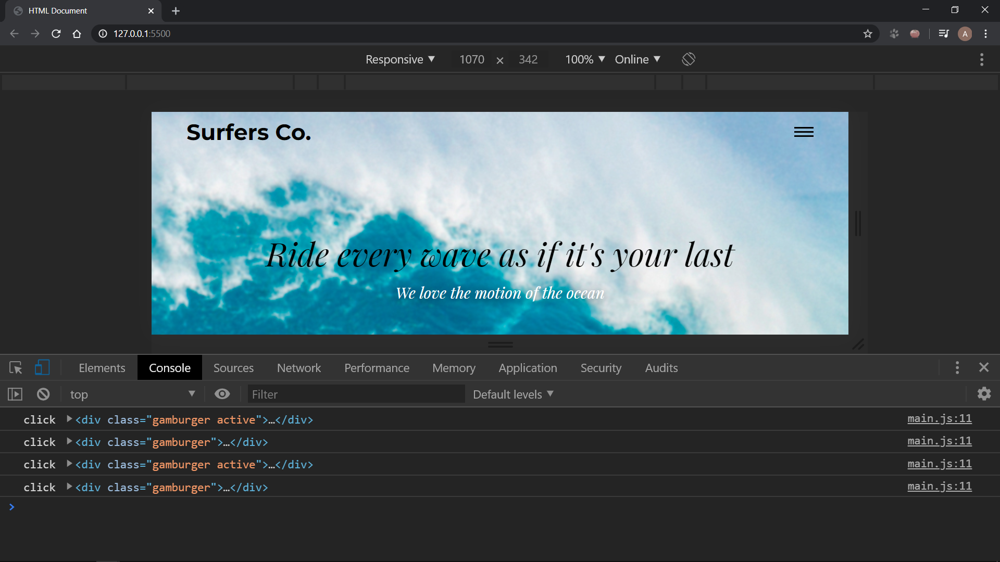
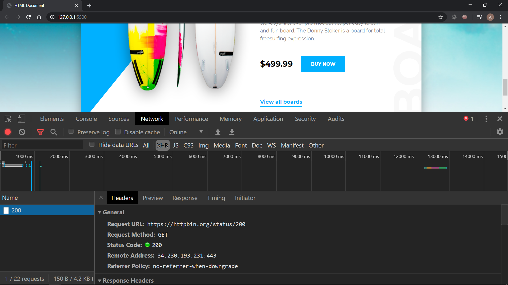

# 05. JavaScript

* [Полезные ссылки](./read.md)
* [Задание](./task.md)
* [Пример](./example)

> Нам потребуется локальный сервер. Если вы пользуетесь редактором `VS Code`, то можете установить расширение `Live Server`. Но вы можете установить и любой другой сервер (например, `Open Server`).

Итак, создадим в нашем проекте папку `js`, где у нас будет храниться файл `main.js`. Подключим наш js файл в разметку перед закрывающим тегом `body`:

```
<script src="./js/main.js" type="module"></script>
```

Внутри папки js создадим папку `src` с файлами `hamburger.js` и `query.js`.

Переменные создаются при помощи `let` и `const` (еще переменные можно создавать через `var`, но его желательно уже не использовать). Получить html элемент мы можем при помощи `querySelector()`, где в скобках в кавычках пишем нужный нам селектор (`.class`, `#id` или иное).

Итак, попробуем получить гамбургер и вывести его в консоль. Для этого в файле `main.js` пропишем:

```
const hamburger = document.querySelector('.header .hamburger');
console.log(hamburger);
```

Открываем консоль и видим наш элемент. При наведении на элемент в консоли он подсвечивается в окне браузера.



Теперь мы можем производить манипуляции с этим объектом. Например, мы можем получить список классов, добавить новый класс или удалить существующий. Также мы можем добавлять стили элементу.

```
hamburger.classList.add('active');
// hamburger.classList.remove('active');
console.log(hamburger);
hamburger.style.background = 'red';
console.log(hamburger.style.background);
```


Еще можно производить какие-либо действия по клику. Для этого нужно повесить слушатель события "click" на наш элемент.

```
hamburger.addEventListener('click', function() {
    hamburger.classList.toggle('active');
    console.log('click', hamburger);
})
```

`addEventListener()` принимает в данном случае два параметра: первый – это тип события, а второй – функция, которая будет выполняться.



Итак, теперь все удаляем и будем писать непосредственно наш код. В файле `hamburger.js` напишем класс и экспортируем его:

```
export default class Hamgurger {
    constructor(hamburger) {
        this.hamburger = hamburger;
    }
}
```

В конструкторе будем принимать наш элемент и с ним мы будем работать. Теперь импортируем наш класс в файле `main.js`:

```
import Hamburger from './src/hamburger.js';

const hamburgerNode = document.querySelector('.hamburger');
const hamburger = new Hamburger(hamburgerNode);
```

Работаем с классом `Hamburger`. Мы в конструкторе повесим на него слушатель на клик и будем вызывать метод после клика.

```
export default class Hamgurger {
    constructor(hamburger) {
        this.hamburger = hamburger;

        this.hamburger.addEventListener('click', e => this.click(e.currentTarget));
    }

    click(item) {
        item.classList.toggle('active');
    }
}
```

Строчка `item.classList.toggle('active')` означает, что мы "переключаем" у элемента класс `.active`. Если этот класс есть, то мы его удаляем. Если нет – добавляем.

Обратите внимание на `this.hamburger.addEventListener('click', e => this.click(e.currentTarget))`. Тут мы вешаем слушатель на наш элемент. Строка `e => this.click(e.currentTarget)` является ничем иным, как обычной функцией (данная функция называется стрелочной). `e` хранит в себе данные о произошедшем событии. Мы передаем в функцию `e.currentTarget` что является элементом, на котором произошел клик.

Теперь можем добавить стили для активного гамбургера. Немного перепишем нашу разметку:

```
<div class="hamburger">
    <div class="hamburger__item"></div>
    <div class="hamburger__item"></div>
    <div class="hamburger__item"></div>
</div>
```

Теперь стили в файле `_header.scss`:

```
.hamburger {
    width: 30px;
    height: 15px;
    cursor: pointer;
    display: none;
    justify-content: space-between;
    flex-direction: column;
    align-items: center;
    position: relative;
    &.active {
        .hamburger__item:nth-child(2) {
            transform: rotate(250deg);
            opacity: 0;
        }
        .hamburger__item:nth-child(1) {
            transform: rotate(405deg);
            top: 6px;
        }
        .hamburger__item:nth-child(3) {
            transform: rotate(-405deg);
            top: -6px;
        }
    }
    &__item:nth-child(1),
    &__item:nth-child(2),
    &__item:nth-child(3) {
        width: 100%;
        border-bottom: 2px solid $dark-color;
        transition: 500ms;
        position: relative;
        top: 0;
    }
}
```

Во время активного положения мы поворачиваем верхнюю "палочку" гамбургера на 45 градусов, а нижнюю на -45 (360 + 45 = 405) и немного ровняем их. Среднюю мы скрываем (поворачиваем только лишь для визуала).

> Если вы хотите изменить два и больше свойств у элемента, то лучше это прописать в разметке, а при помощи js просто реализовать переключение классов.

Теперь напишем наш запрос к серверу. При нажатии на кнопку будет отправляться AJAX-запрос с использованием fetch. Итак, пишем в файле `query.js`:

```
export default class Query {
    constructor(url) {
        this.url = url;
    }

    sendQuery(button) {
        button.addEventListener('click', () => fetch(this.url));
    }
}
```

При создании нового объекта мы передаем url, к которому будем обращаться. При вызове метода `sendQuery()` мы передаем кнопку, при клике на которую запрос отправляется. Теперь посмотрим на файл `main.js`:

```
const priceButton = document.querySelector('.price__button');
const urlQuery = 'https://httpbin.org/status/200';
const query = new Query(urlQuery);
query.sendQuery(priceButton);
```

Результат вы можете увидеть во вкладке `Network`:



[Назад](./../README.md)
