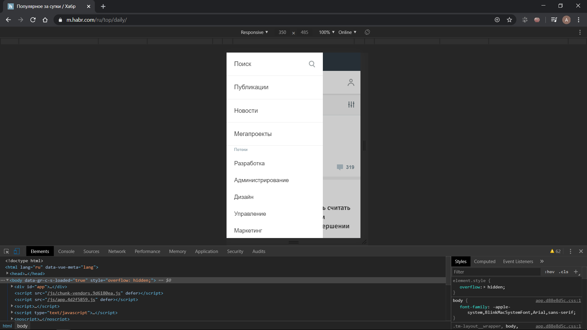

# Задание (JavaScript)

1. Реализовать гамбургер меню, которое будет выезжать из края экрана (либо каким-нибудь другим образом появляться). При появлении меню нужно запретить пользователю скроллить сайт;
2. Сделать попап окно при клике на любую из кнопок на сайте. Попап окно должно содержать форму из минимум 2-х полей и кнопки. Закрываться попап окно должно при клике на крестик либо на затемняющий оверлей под ним;
3. При вводе данных пользователем в попап форму и клике на кнопку данные должны быть отправлены по адресу `https://httpbin.org/status/200`. При успешной отправке вывести соответствующее сообщение. Уведомить пользователя соответствующим сообщением, если данные не были отправлены.

Пример меню гамбургера:

Пример попап окна:

[Назад](./readme.md)
